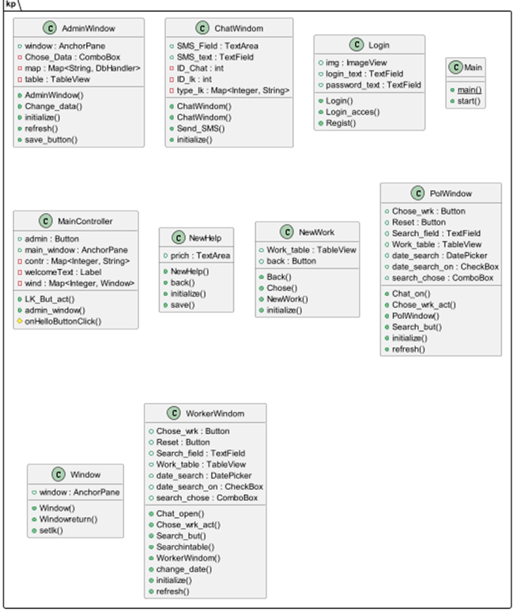
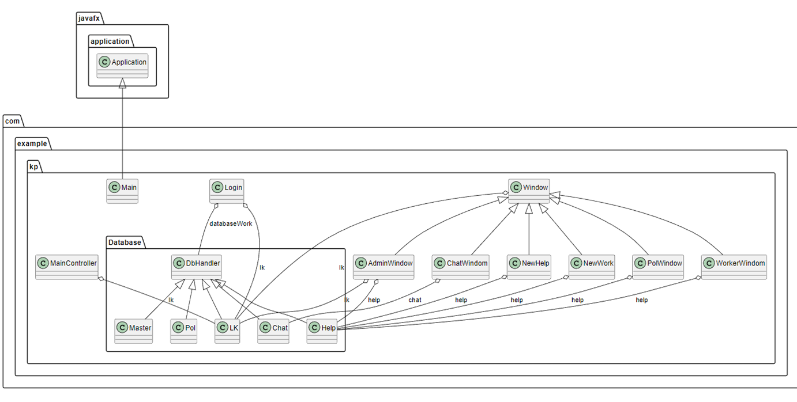
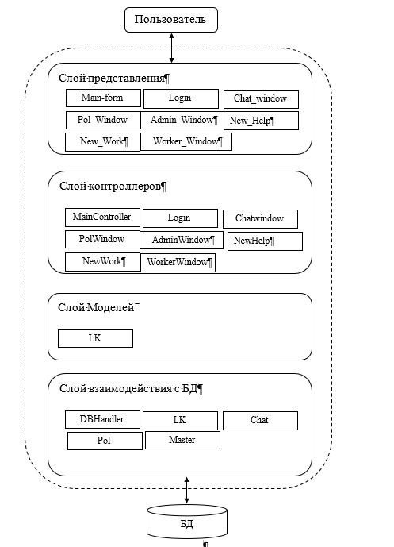

# Программа "ДИС Хелп"

## Описание

Программа "Лис хелп"   обладает функциями учета, планирования и контроля финансов, оптимизации и прогнозирования расходов. Пользователь может создавать бюджеты и конкретные категории расходов и доходов для каждого бюджета. Также пользователь может визуализировать данные в виде графиков, выводить статистику и прогнозировать будущие расходы. 

## Диаграмма классов программы

## Архитектура
В качестве архитектуры приложения был выбран архитектурный стиль МVC (model-view-control). Основная цель применения MVC состоит в разде-лении данных и бизнес-логики от визуализации. За счет такого разделения повышается возможность повторного использования программного кода: например, добавить представление данных какого-либо существующего маршрута не только в виде HTML, но и в форматах JSON, XML, PDF, XLSX становится очень просто и не требует исменений слоя бизнес-логики исход-ного маршрута. Также упрощается и сопровождение программного кода: внесение изменений во внешний вид, например, не отражаются на бизнес-логике, а изменения бизнес-логики не затрагивают визуализацию.[3]
Концепция MVC разделяет данные, представление и обработку дей-ствий пользователя на компоненты:
•	Модель / Model — предоставляет собой объектную модель некой пред-метной области, включает в себя данные и методы работы с этими данными, реагирует на запросы из контроллера, возвращая данные и/или изменяя своё состояние. При этом модель не содержит в себе информации о способах визуализации данных или форматах их пред-ставления, а также не взаимодействует с пользователем напрямую. В реализуемом программном продукте в качестве модели представлены классы: 
•	LK – представляет собой сущность LK; 
•	Представление / View — отвечает за отображение информации (визуа-лизацию). Одни и те же данные могут представляться различными способами и в различных форматах. Например, коллекцию объектов при помощи разных представлений можно представить на уровне пользовательского интерфейса как в табличном виде, так и списком; на уровне API можно экспортировать данные как в JSON, так в XML или XSLX. В качестве View компонентов в данном продукте пред-ставлены fxml компоненты: 
•	Main-form – представляет интерфейс главного окна с меню;
•	Login – представляет интерфейс окна для идентификации;
•	Chat_window – представляет интерфейс окна отображение чата;
•	Pol_window – представляет интерфейс окна отображения окна за-просов в техподдержку.
•	Admin_window – представляет интерфейс окна отображения окна администратора.
•	Worker_window – представляет интерфейс окна отображения окна запросов для техподдержки.
•	New_Help – представляет интерфейс окна отображения окна сроздания запросов.
•	New_Work – представляет интерфейс окна отображения окна при-нятия работы техподдержкой.
•	Контроллер / Controller — обеспечивает связь между пользователем и системой, использует модель и представление для реализации необхо-димой реакции на действия пользователя. Как правило, на уровне контроллера осуществляется фильтрация полученных данных и авто-ризация — проверяются права пользователя на выполнение действий или получение информации [1]. В качестве котроллеров в данном программном продукте представлены:
•	MainController – реализует взаимодействие с окном, представлен-ным компонентом Main-form.fxml;
•	Login – реализует взаимодействие с окном, представленным компо-нентом Login.fxml;
•	ChatWindom – реализует взаимодействие взаимодействие с окном, представленным компонентом Chat_window.fxml;
•	PolWindow – реализует взамодействие с окном, представленным компонентом Pol_window.fxml.
•	AdminWindow – реализует взамодействие с окном, представленным компонентом Admin_window.fxml
•	MasterWindow – реализует взамодействие с окном, представленным компонентом Master_window.fxml
•	NewHelp – реализует взамодействие с окном, представленным ком-понентом New_Help.fxml
•	NewWork – реализует взамодействие с окном, представленным компонентом New_Work.fxml
Также стоит выделить компоненты, которые нельзя точно отнести к Model. Они имеют роль взаимодействия с базой данных и внешним API, то есть выполняя бизнес логику. К ним можно отнести классы: 
•	DBHandler, Chat, LK, Pol Master– взаимодействуют с базой данных, обрабатывают получаемые данные. 

## Использованные паттерны
В ходе создания программного продукта были использованы паттерны Фабрика и DAO. Они объедены в стратегию Factory for DAO (фабрика для DAO). Изначально, возникла потребность в использовании базы данных в программном продукте. Для реализации логики было решено использовать паттерн DAO. DAO реализует необходимый для работы с источником дан-ных механизм доступа.   Использующие DAO бизнес-компоненты работают с более простым интерфейсом, предоставляемым объектом DAO своим клиен-там. DAO полностью скрывает детали реализации источника данных от кли-ентов. Поскольку при изменениях реализации источника данных представля-емый DAO интерфейс не изменяется, этот паттерн дает возможность DAO принимать различные схемы хранилищ без влияния на клиенты или бизнес-компоненты. По существу, DAO выполняет функцию адаптера между компо-нентом и источником данных [4]. Это вариант удобен для использования в концепции MVC потому, что позволяет убрать логику работы с базой дан-ных из контроллеров и объединить в одном месте. При определении интер-фейсов DAO было выделено два интерфейса, которые объединяют методы работы с базой данных. Один интерфейс описывает стандартную логику с базой данных - простые запросы на добавление, удаление и получение ин-формации.  Второй интерфейс требуется для работы с базой данных при сложных запросах – получение информации для графиков и статистических расчетов. 
 	Фабрика позволяет достичь лучшей абстракции и гибкости. При до-бавлении новой логики для DAO достаточно всего лишь добавить создание объекта класса, реализующего интерфейс нового DAO, в интерфейс и класс, реализующий интерфейс Фабрики. Кроме того, в классе, реализующем ин-терфейс Фабрики, происходит подключение к базе данных, что объединяет логику работы с базой данных. Фабрика позволяет генерировать объекты классов DAO разных типов, что позволяет абстрагироваться от конкретных реализаций DAO, улучшает модульность и поддерживаемость кода[5].

